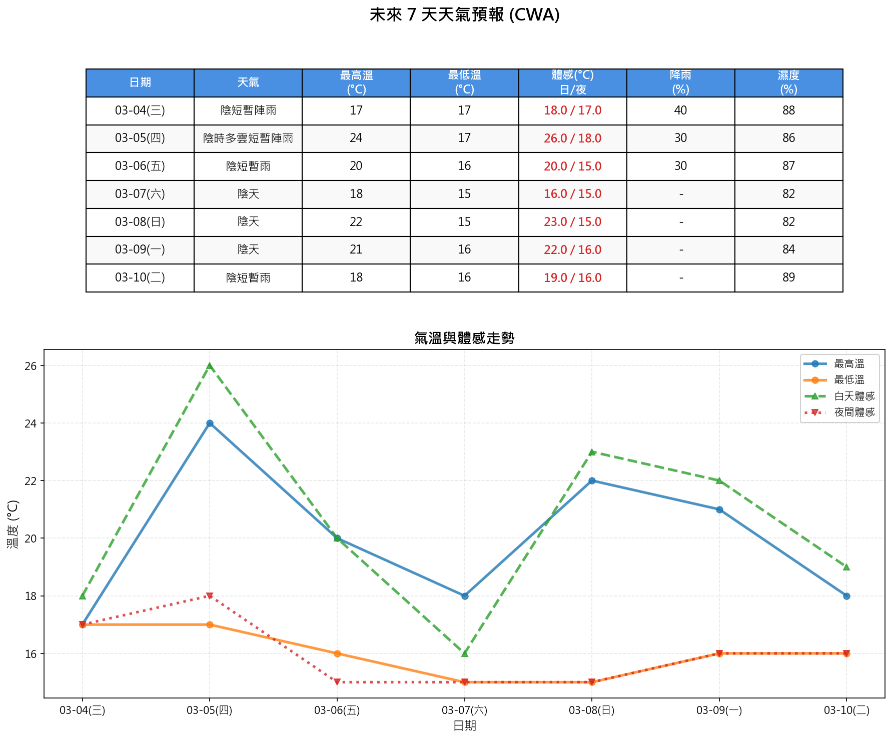

# AI 天氣報告（機車通勤族專用）

[](LICENSE)
[](https://github.com/bruce-yang-422/ai_weather_report/commits/main)
[](https://github.com/bruce-yang-422/ai_weather_report)
[](https://www.python.org/)

一個結合「開放氣象 API + OpenAI」的 **機車通勤族專用天氣小幫手**：

自動抓取未來一週天氣，計算真實體感溫度，產出：

- 圖像化天氣報表（`weather_report.png`）
- 結構化文字分析（`weather_analysis.txt`）
- 針對機車通勤族優化的 AI 天氣說明與貼心提醒

---

## 功能特色

- **真實體感溫度**：考慮溫度、濕度、風速、太陽輻射，計算日/夜體感溫度  
- **機車通勤族友善**：
  - 針對早上/晚上通勤時段重點說明  
  - 自動偵測強風並給出風險提醒  
- **圖文並茂輸出**：
  - 圖像報表：每日最高/最低溫、體感溫度趨勢  
  - 文字報告：適合貼到 LINE / 訊息群組  
- **隱私友善**：API Key 存在 `config/Weather_descriptions_API_keys.json`，且已列入 `.gitignore` 不會上傳到 GitHub

---

## 專案結構

```text
ai_weather_report
├── config/                    # 存放配置檔案（未納入版控）
│   ├── config.yaml            # GPS 位置、時區、字型等系統設定（可自行修改）
│   └── Weather_descriptions_API_keys.json  # OpenAI API Key 設定
├── mapping/
│   └── weather_analysis.yaml  # 文字分析/報告格式對照設定
├── output/                    # 執行後自動產出的結果檔
│   ├── weather.log            # 執行日誌
│   ├── weather_analysis.txt   # 結構化文字報告
│   └── weather_report.png     # 圖像化天氣報表
├── scripts/
│   └── weather.py             # 主程式：抓氣象＋生成報表＋呼叫 OpenAI
├── project_structure.txt      # 專案樹狀結構說明
├── project_tree_generator.py  # 產生 project_structure.txt 用的小工具
├── requirements.txt           # Python 套件需求
└── README.md
```

---

## 環境需求

- **作業系統**：Windows / macOS / Linux 皆可  
- **Python 版本**：建議 `Python 3.10+`  

安裝相依套件：

```bash
pip install -r requirements.txt
```

---

## 設定步驟

### 1. 設定 OpenAI API Key

1. 在 `config/` 資料夾內建立（或編輯）檔案：`Weather_descriptions_API_keys.json`  
2. 寫入內容範例：

```json
{
  "openai_api_key": "sk-xxxxxxx_your_key_here",
  "openai_model": "gpt-4o-mini"
}
```

> **注意：** 此檔已在 `.gitignore` 中排除，請勿手動加入 Git。

### 2. 設定 GPS 位置與系統參數

編輯 `config/config.yaml` 檔案，可自行修改以下設定：

```yaml
# GPS 位置設定（用於取得天氣資料）
location:
  latitude: 25.04694511723731   # 緯度（預設：泰山明志書院）
  longitude: 121.42667399750172 # 經度
  timezone: "Asia/Taipei"       # 時區

# 字型設定（用於圖表顯示）
font:
  path: "C:\\Windows\\Fonts\\msjh.ttc"  # Windows 路徑
  fallback:
    - "Microsoft JhengHei"
    - "SimHei"
```

> **提示：** 若找不到 `config/config.yaml`，程式會使用預設值（泰山明志書院位置）。

---

## 使用方式

1. 確認已安裝套件並設定好 `config/Weather_descriptions_API_keys.json`  
2. 在專案根目錄執行：

```bash
python scripts/weather.py
```

3. 執行完成後，可在 `output/` 看到：

   - `weather_report.png`：未來 7 日圖像化報表  
   - `weather_analysis.txt`：結構化文字報告（含今日概況、未來一週、貼心提醒）  
   - `weather.log`：完整執行與錯誤紀錄  

---

## 輸出範例

### 圖像化報表



### 文字報告範例

以下是 `weather_analysis.txt` 的輸出範例：

```text
01-06(二) 氣象日報

🌤️ 今日概況
氣溫：11.8~14.9°C
體感：日 12.0°C / 夜 9.7°C
降雨機率：13%
整天陰涼偏冷，騎車記得穿外套、手套保暖就算舒適。

📅 未來一週
- 週三(01-07)：☁️ 氣溫 11.5-13.7°C / 體感 10.1-8.1°C / 降雨 10%
- 週四(01-08)：☁️ 氣溫 11.6-14.1°C / 體感 10.0-7.9°C / 降雨 0%（持續陰冷但不太會下雨，適合騎車，上下班要注意保暖。）
- 週五(01-09)：☁️ 氣溫 11.8-16.3°C / 體感 12.9-11.7°C / 降雨 3%
- 週六(01-10)：☁️ 氣溫 10.2-18.2°C / 體感 16.8-10.2°C / 降雨 0%（多雲轉暖，白天騎車最舒適的一天，早晚溫差大外套別脫太早。）
- 週日(01-11)：☁️ 氣溫 13.1-18.3°C / 體感 12.8-12.7°C / 降雨 0%
- 週一(01-12)：🌧️ 氣溫 14.6-16.6°C / 體感 17.4-16.2°C / 降雨 6%（小雨陰天，通勤務必穿雨衣、戴防水手套，路面溼滑放慢車速。）

💡 貼心提醒
這週大致偏陰涼，前幾天清晨、晚上騎車都很冷，要有保暖手套、口罩和防風外套；週末稍微回暖但仍有溫差，雨具建議週一開始放車廂備用，遇到濕冷天通勤記得預留多一點時間慢騎。
```

---

## 開發筆記

- **天氣資料來源**：`open-meteo.com`（免金鑰）  
- **AI 模型**：經由 `openai` 官方 SDK 呼叫（模型名稱可在 JSON 設定檔調整）  
- **配置管理**：
  - GPS 位置、時區、字型等系統設定：`config/config.yaml`（可自行修改）
  - OpenAI API Key：`config/Weather_descriptions_API_keys.json`（已排除出版本控制）
- **字型設定**：預設使用 Windows `C:\Windows\Fonts\msjh.ttc`，如在 macOS / Linux 可修改 `config/config.yaml` 中的 `font.path`

---

## 授權條款

本專案採用 MIT 授權條款，詳見 [`LICENSE`](LICENSE)。

